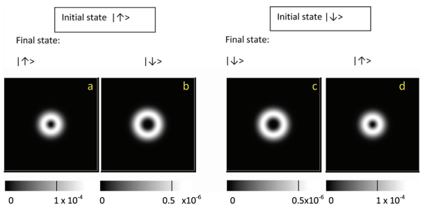

# Multislice Spin Polarizer

This is meant to be a recreation of the multislice FFT simulation presented in the following paper by Vincenzo Grillo, Lorenzo Marrucci, Ebrahim Karimi, Riccardo Zanella, Enrico Santamato:

[Quantum simulation of a spin polarization device in an electron microscope](https://iopscience.iop.org/article/10.1088/1367-2630/15/9/093026)

This code also provides a realtime visualization of the wavepacket as it moves through each slice.

The simulation is still incomplete as there is still work to do on the wavepacket evolution. The result is supposed to yield two distinguished polarized wavepackets as follows:

For more information about the logic of multislice algorithm refer to Kirkland, E. J. (2010). Advanced Computing in Electron Microscopy. [doi:10.1007/978-1-4419-6533-2](https://doi.org/10.1007/978-1-4419-6533-2)
